# Charts

All 11 charts below were built with **Plotly** (`plotly.express` / `plotly.graph_objects`) directly from the cleaned datasets in [`/dataset`](../dataset). Each chart is provided as:

- a static **`.png`** (what renders in this README)
- an interactive **`.html`** (open in a browser for hover tooltips, zoom, and pan)

`generate_charts.py` in this folder reproduces every chart from scratch — see [Reproducing the charts](#reproducing-the-charts) below.

---

### 01 — Daily Active Users
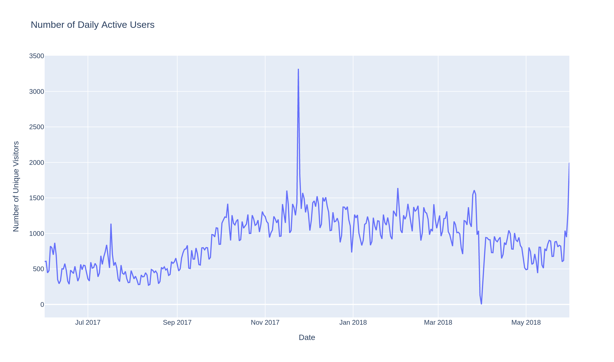

Unique users per calendar day across the full year. Average **DAU ≈ 908**, against an average **MAU ≈ 23,228**, giving a **sticky factor (DAU/MAU) of ~3.9%** — the typical user visits the site roughly once every three to four weeks rather than daily.

### 02 — Session Duration Distribution
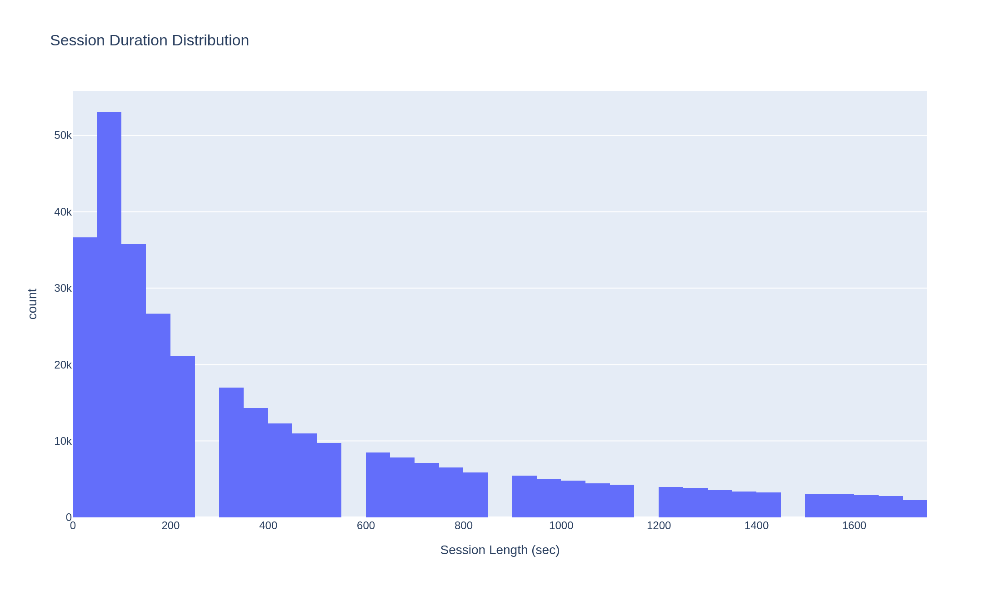

Distribution of session lengths under 30 minutes (the long tail beyond that is excluded to keep the histogram readable). The distribution is heavily right-skewed: median session length is **300 seconds (5 min)**, mean is **643 seconds (10.7 min)**, and the single most common duration is only **60 seconds** — most sessions are short, with a smaller number of long sessions pulling the mean upward.

### 03 — User Retention Matrix
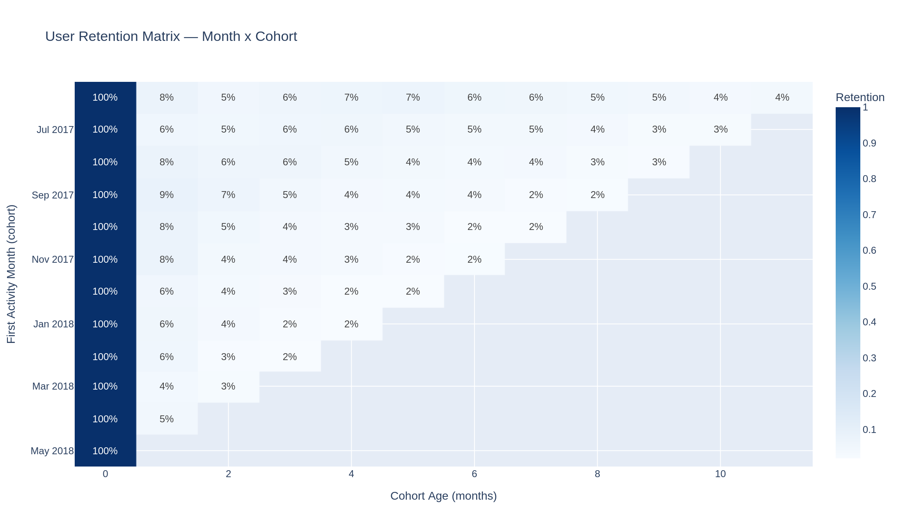

Cohort retention heatmap: each row is a monthly cohort (grouped by first activity month), each column is months since first activity, and each cell is the % of that cohort still active in that month. Retention drops sharply to **~7% by Month 2** and stabilizes around **3–5%** afterward — most users churn almost immediately, and the site does not build a meaningfully engaged repeat-visit base.

### 04 — Conversion Time Distribution
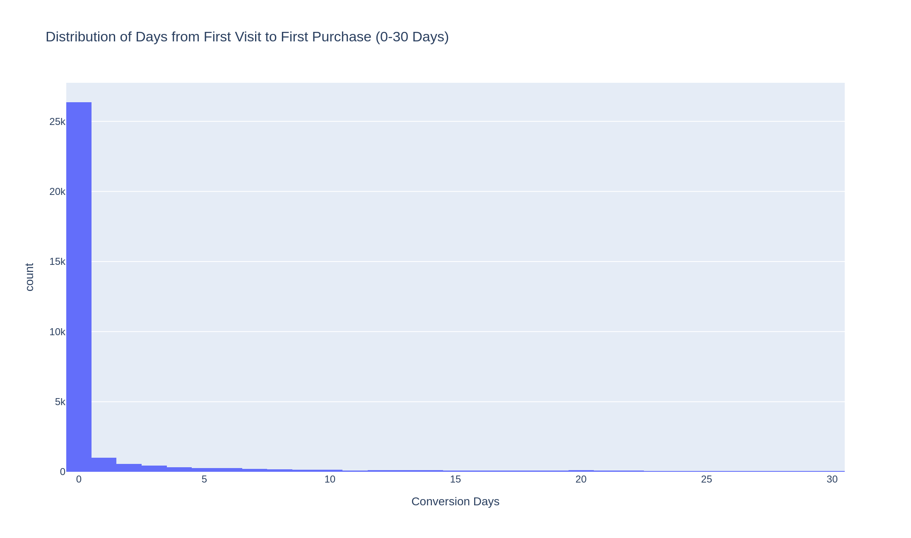

Days between a user's first visit and their first purchase, capped at 30 days. **72% of buyers purchase on the same day** as their first visit (median = 0 days), pointing to strong impulse-buying behavior rather than a considered, multi-visit purchase journey.

### 05 — Monthly Orders
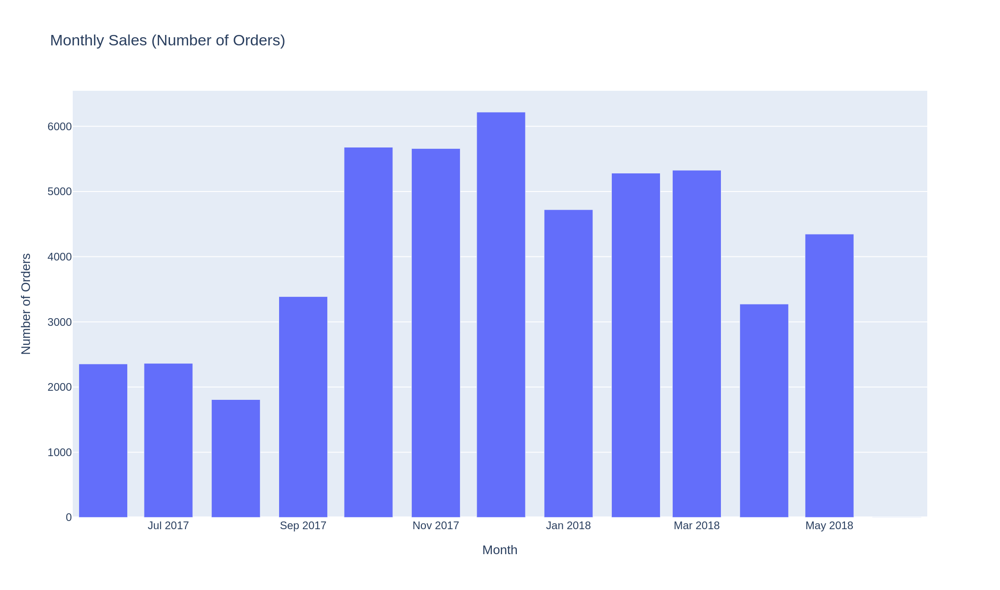

Total number of orders placed per calendar month. Volume peaks toward **December**, consistent with seasonal/holiday shopping demand.

### 06 — Cumulative LTV by Cohort
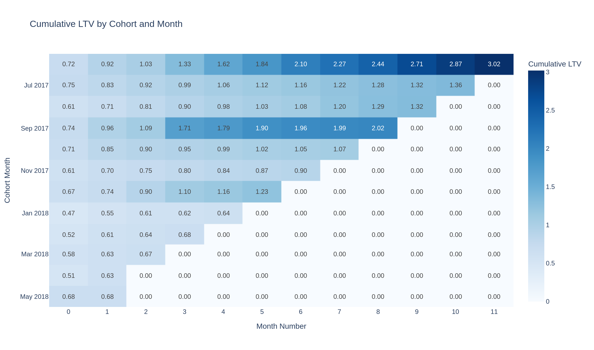

Cumulative customer lifetime value (revenue ÷ cohort size, summed month over month) for each monthly acquisition cohort. Later-month figures are blank where a cohort hasn't existed long enough to have data for that month number — this is expected, not missing data.

### 07 — Marketing Costs by Source
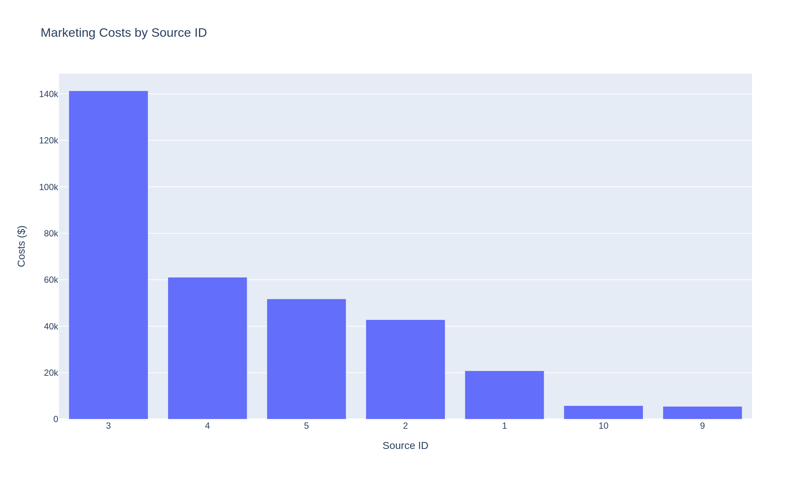

Total ad spend per traffic source for the year. **Source 3 dominates spend at ~$141K**, more than double the next-highest source (Source 4, ~$61K).

### 08 — Marketing Costs by Month
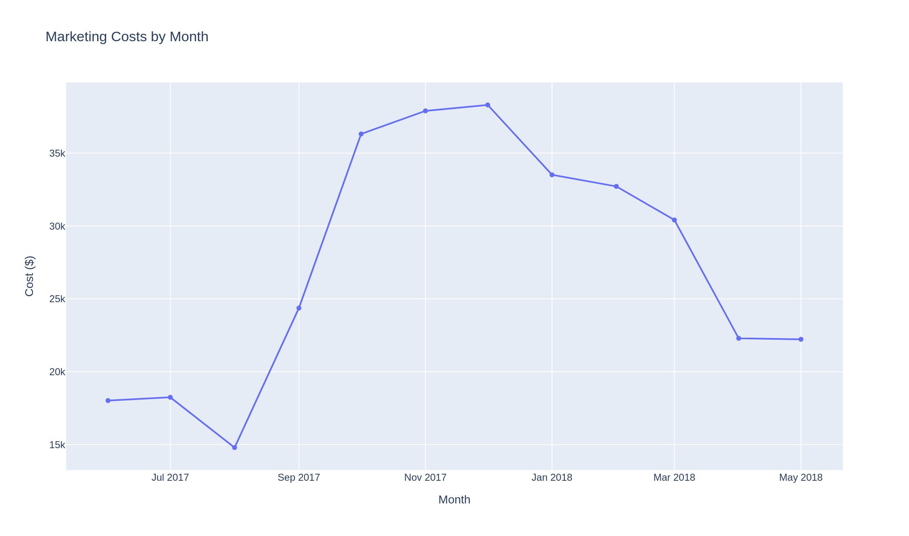

Total marketing spend per calendar month, showing how budget allocation shifted across the year (spend rises toward the winter months, in line with the order volume seen in chart 05).

### 09 — Customer Acquisition Cost (CAC) by Source
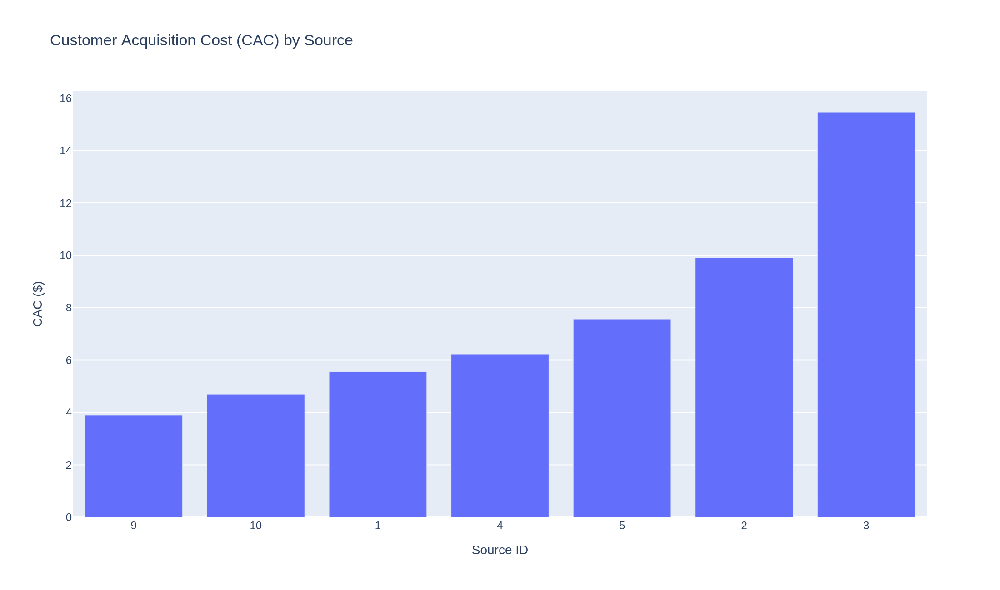

Cost per acquired buyer, by traffic source. CAC varies **~4x across sources** — from ~$3.9 (Source 9) to ~$15.5 (Source 3). Source 3 is both the highest-spend and the least cost-efficient channel.

### 10 — Cumulative ROI by Cohort
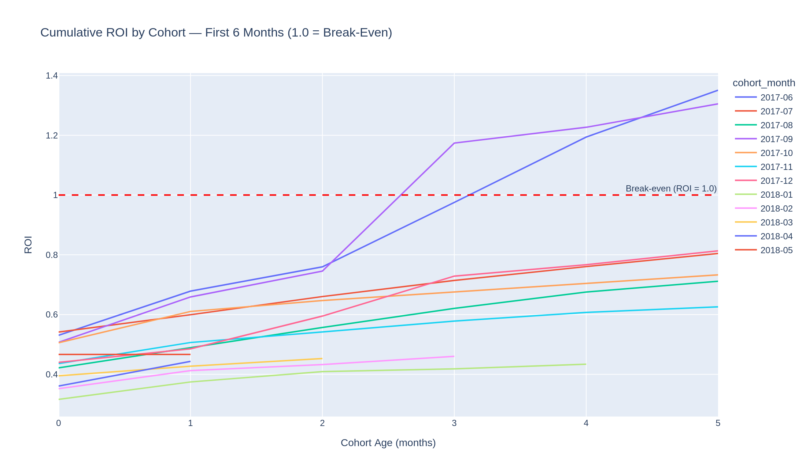

Cumulative LTV ÷ CAC for each cohort over its first 6 months, with a break-even line at ROI = 1.0. **No cohort reaches break-even within 6 months** — the best-performing cohorts plateau around **1.3–1.35** while others stay well below, indicating marketing spend is not recovered quickly for a meaningful share of cohorts.

### 11 — Sessions by Device
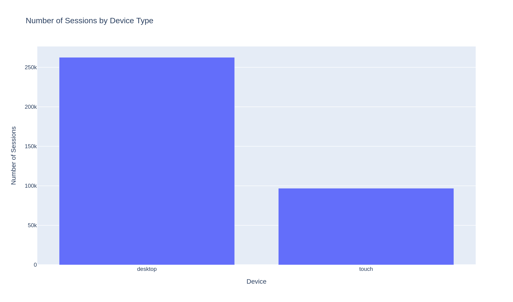

Session count split by device type. **Desktop accounts for the large majority of sessions**, indicating greater user activity on desktop than touch devices.

---

## Reproducing the charts

```bash
pip install pandas numpy scipy "plotly==5.24.1" "kaleido==0.2.1"
python generate_charts.py
```

The script reads the three CSVs from `../dataset`, re-runs the same cleaning and aggregation steps used in the [notebook](../notebook), and writes both `.png` and `.html` versions of all 11 charts into this folder.

> **Note on causation:** several charts here (e.g. 07–10) compare spend, acquisition, and revenue. A positive relationship between two of these series does not by itself prove one causes the other — both can be driven by a shared factor such as seasonal demand. See the correlation check in the [notebook](../notebook) for the explicit test on this.

